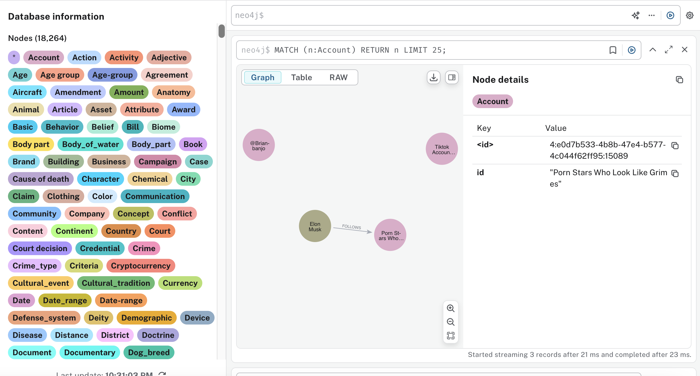

# Community Notes as an Efficient Fact-Checking Source

## Abstract
Community Notes, a crowdsourced fact- checking system on Twitter/X, offers contextual annotations to potentially misleading posts as an alternative to expert and automate fact- checking. This study explores the feasibility of using published Community Notes as a standalone fact-checking source. We hypothesize that Community Notes, as a curated knowledge base, can improve fact-checking efficiency without compromising accuracy. Un-like large-scale fact-checking systems, Community Notes offers a targeted approach that captures recurring misinformation topics. To test this, we will create a knowledge graph (KG) from Community Notes using large language models (LLMs) and integrate it into an automated fact-checking pipeline, applying Knowledge-Augmented Generation (KAG) and Retrieval-Augmented Generation (RAG) techniques. We will evaluate the system by com- paring its outputs to established fact-checking datasets like DBPedia, . This report outlines the literature review, data collection, preliminary experiments, methodology, evaluation strategy, and project tasks.

## Files & Directories
```
llm-kag-communitynote/
├── fact-checker-extension/          # Chrome extension for fact-checking (only for fun and application testing)
├── data/
│   ├──database_dump/               # Neo4j database dump files
│       ├── community.dump            # Dump file for the community database (process all community notes)  
│       ├── politifact.dump           # Dump file for the news articles database (process only 3 topics)
│       └── community3topics.dump     # Dump file for the community database (process only 3 topics)               
│   ├── graph_data/                    # Excel files for building the knowledge graph              
│       ├── 3toics_notes.xlsx         # Excel file for the 3 topics, community notes
│       ├── 3topics_url.json          # JSON contains for url for web scrapping only
│       ├── mislead_politics.xlsx      # Excel file for the misleading community notes, topic politics
│       ├── nonmis_politics.xlsx       # Excel file for the nonmislead community notes, topic politics
│   ├── query/                          # Query files for verifying the knowledge graph
│   ├── result_data/                    # Result data for verifying the knowledge graph
├── BuildGraph.py              # Python script to build the knowledge graph
├── AnalyzeAccuracy.py         # Python script to analyze the accuracy of the knowledge graph
├── NotesProcessor.py          # Python class to process the Community Notes files
├── MongoDBService.py          # Python class to connect to the MongoDB database
├── KnowledgeGraphService.py  # Python class to connect to the Neo4j database
├── FactCheckAgent.py          # Python script to create a fact-checking agent
├── API.py                     # Python script to create a REST API for the fact-checking agent and extension
├── requirements.txt              # Python dependencies

```

## Published Knowledge Graph from X's Community Notes
Please provide us with your email address of Neo4j Aura if you want to access the knowledge graph. We will send you the invitation link to access the knowledge graph.




## How to setup in your local environment
1. Download Neo4j Desktop
2. Install APOC plugin and follow their instruction
https://neo4j.com/docs/apoc/5/installation/?_gl=1*1gdaha5*_ga*MTk0MDk5NjkzNy4xNzQxNjUyMjM2*_ga_DZP8Z65KK4*MTc0MTY1MjIzNC4xLjEuMTc0MTY1NTIyNi4wLjAuMA..
3. create 2 database 
```
- community
- news_articles or politifact
```

(optional) if there is problem with APOC, you can add the following lines to your `neo4j.conf` file:

```
dbms.security.procedures.unrestricted=apoc.*
dbms.security.procedures.allowlist=apoc.*
```

4. Clone this repository:

```
git clone https://github.com/courtofdreams/llm-kag-communitynote.git
cd llm-kag-communitynote
```
5. Create and activate a virtual environment:

```
# Create a virtual environment
python -m venv venv

# Activate the virtual environment
# On Windows:
venv\Scripts\activate

# On macOS/Linux:
source venv/bin/activate
```

6. Install the required dependencies:

```
pip install -r requirements.txt
```

4. Create a `.env` file in the project root with:

```
 OPENAI_API_KEY=your-openai-api-key
 NEO4J_URI=neo4j_uri ex : bolt://localhost:7687
 NEO4J_USERNAME=your-neo4j-username
 NEO4J_PASSWORD=NEO4J_USERNAME=your-neo4j-password
```
(optional) if you want to use the chrome extension, add the following lines to your `.env` file:
```
TWITTER_API_KEY=
TWITTER_API_SECRET_KEY=
TWITTER_ACCESS_BEARER_TOKEN=
TWITTER_ACCESS_TOKEN=
TWITTER_ACCESS_TOKEN_SECRET=
```

5. Option1: To build the knowledge graph, run the following command:

```
python3 -m BuildGraph.py 
```

```
enter 1: for building community notes knowledge graph
enter 2: for building news articles/other compared knowledge graph
```

after that, you will be asked enter data file path, you can use the following data files:
data/graph_data/mislead_politics.xlsx


5. Option2: To build the knowledge graph using .dump file in the `data/database_dump` folder using neo4j Desktop according to [this instruction](https://neo4j.com/docs/desktop-manual/current/operations/create-from-dump/#:~:text=Once%20you%20have%20a%20dump,when%20creating%20a%20new%20DBMS.)
```
- community.dump: the dump file for the community database (process all community notes)
- politifact.dump: the dump file for the news articles database (process only 3 topics)
- community3topics.dump: the dump file for the community database (process only 3 topics)
```
6. to verify the knowledge graph, run the following command:

```
python3 -m AnalyzeAccuracy.py 
```

7. To run the API, run the following command:

```
python3 -m API.py
```

